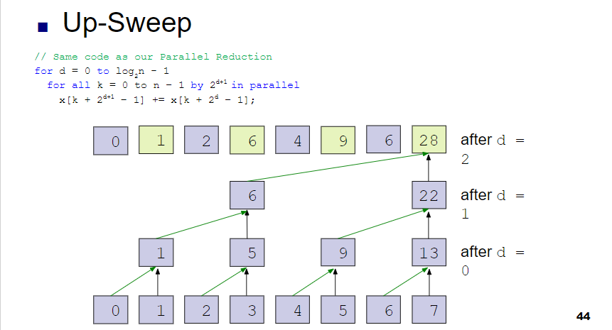
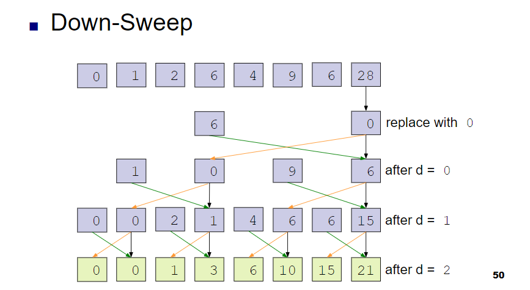
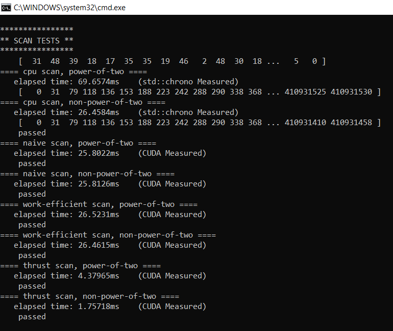
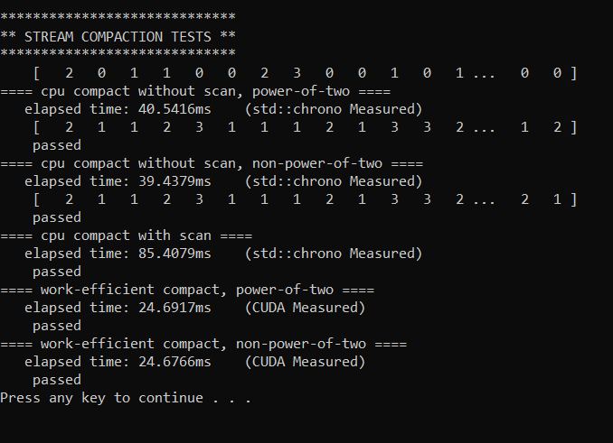
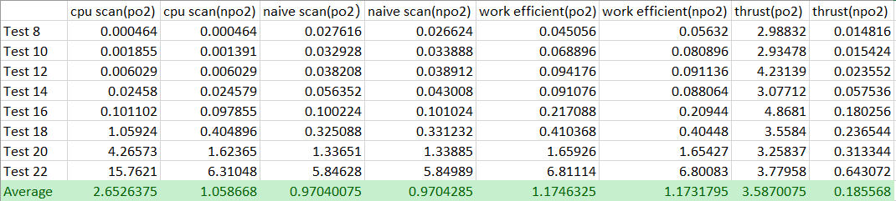
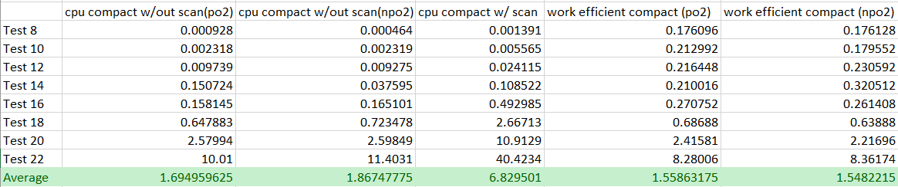
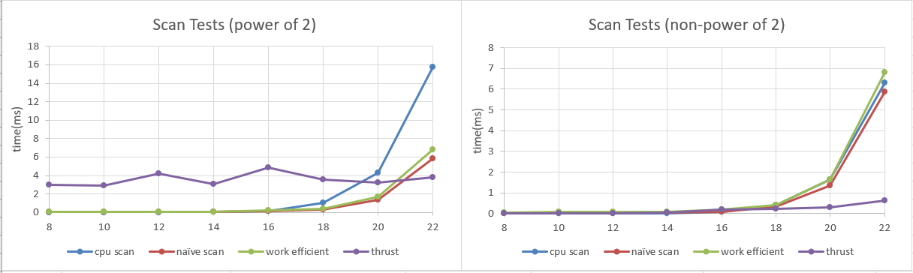
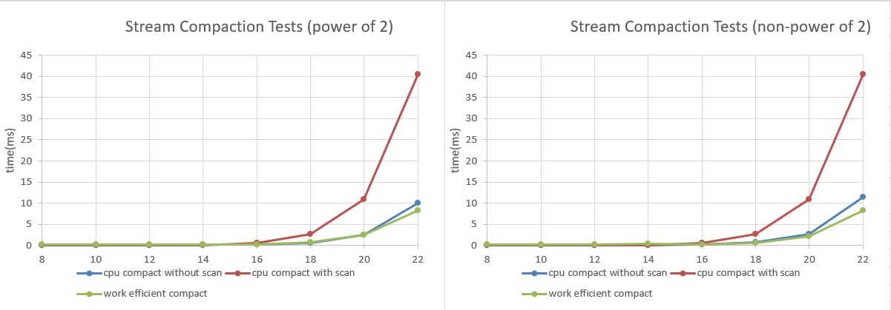

CUDA Stream Compaction
======================

**University of Pennsylvania, CIS 565: GPU Programming and Architecture, Project 2**

* Yan Wu
  * [LinkedIn](https://www.linkedin.com/in/yan-wu-a71270159/)
* Tested on: Windows 10 Education, i7-8750H @ 2.2GHz 16GB, GTX 1060 6GB (Personal Laptop)

### Project Description

This project let us implement a few different versions of the Scan (Prefix Sum) algorithm. 
1. Implementing a CPU version of the algorithm. 
2. Writing a few GPU implementations: "naive" and "work-efficient." 
3. Using some of these to implement GPU stream compaction.

* [Algorithm Slides:](https://docs.google.com/presentation/d/1ETVONA7QDM-WqsEj4qVOGD6Kura5I6E9yqH-7krnwZ0/edit#slide=id.p126)
* Algorithm Demonstration:
  * Naive Inclusive Scan: 
    
  * Work Efficient Scan (up-sweep):  
    
  * Work Efficient Scan (down-sweep):  
  
  
### Result and Performance Analysis

* A sample of outcomes:
  * Scan Test:  
    
  * Stream Compaction Test:  
    
 
* Result Sheets:
  * Scan Test Result: 
    
  * Compaction Test Result: 
    
    
* Analysis:
  * Scan Test Charts: 
    
  * Compaction Test Charts: 
     
    Just to mention, the two red lines regarding "cpu compact with scan" in both above charts are the same line.
  * Analysis: 
  First we can see that GPU isn't performing significantly better when the test array is short. But when array becomes very large, it also becomes a burden for the CPU and the executing time increases almost exponentially. Under this circumstance we should perceive a much greater performance outcome by GPU. 
  Taking a closer look, my work efficient algorithm is slower than the naive method when the test array is relatively shorter. As array size increases, work efficient method has a trend of better performance. Thrust method is steady. It may seems slow at first, but when array size increases, its time remains almost the same. Comparing all these methods, thrust scan is clearly the best when array is incredibly large.

* Q & A:
  * Roughly optimize the block sizes of each of your implementations for minimal run time on your GPU. 
  My block size was 128.
  * Why does work efficien method slower than naive? 
  When implementing algorithm from the course slides, we did reduced the calculation count since we only need to compute half of the elements involved each round. Although we did this, half of each warp didn't even work. Implementing a parallel reduction and reduce the working warp number could save a lot time on this issue.

